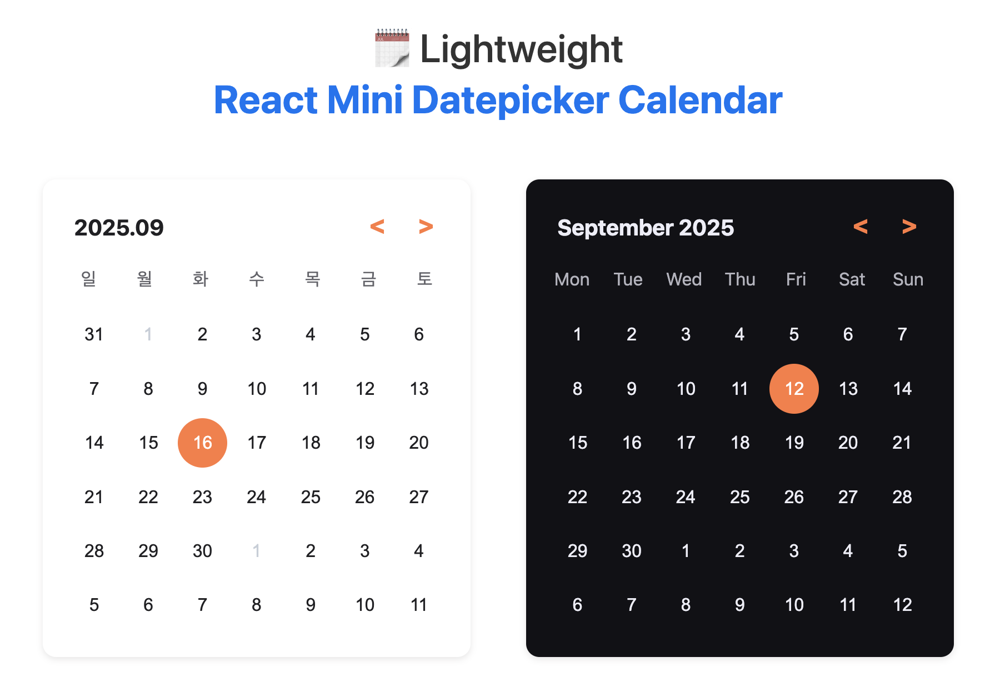

# React Simple Calendar Light



# Overview

**React Simple Calendar Light** is a lightweight, versatile calendar component for React.  
Select dates easily and customize the theme, locale, and other features.  
It’s designed to be simple, extensible, and ready for future integration with timepicker or scheduler.

---

## Features

### Core Functionality

-   ☝️ **Date Selection** - Click to select any date with visual feedback
-   🔢 **Date Filtering** - Optionally filter selectable dates using `filterDate`
-   👀 **Month Navigation** - Browse previous and next months seamlessly
-   ☀️ **Today Highlighting** - Clear visual distinction for the current date
-   🗓️ **Min/Max Date** - Restrict selectable dates with `minDate` and `maxDate`

### Customization

-   🎨 **Themes** - Use `theme` or `customTheme` for full color customization
-   🏷️ **Custom Weekdays** - Override weekday names with `customWeek`
-   🌍 **Locale Support** - Change language via `locale` prop
-   🛠️ **Flexible Controls** - Replace previous/next buttons with `customPrevButton` and `customNextButton`
-   📅 **Date Format** - Customize display with `formatDate`
-   🗓️ **Week Start** - Set starting day of the week with `startOfWeek`

## Installation

Install the package in your React project:

```bash

npm install react-simple-calendar-light

```

## Usage

```tsx
import { useState } from 'react';
import { Calendar } from 'react-simple-calendar-light';
import 'react-simple-calendar-light/react-simple-calendar-light.css';

function App() {
    const [selectedDate, setSelectedDate] = useState(new Date());

    const handleDateChange = (newDate: Date) => {
        setSelectedDate(newDate);
    };

    return <Calendar value={selectedDate} onChange={handleDateChange} />;
}

export default App;
```

> **Note:** To apply default styles, make sure to import the CSS file:

> ```ts
> import 'react-simple-calendar-light/react-simple-calendar-light.css';
> ```

## Props

| Prop Name        | Type                    | Description                                          |
| ---------------- | ----------------------- | ---------------------------------------------------- |
| date             | Date                    | Currently selected date. **Required**                |
| onChange         | (date: Date) => void    | Callback when the date changes. **Required**         |
| theme            | ThemeType               | Built-in theme, e.g., "light" or "dark"              |
| locale           | LocaleType              | Language for the calendar ("en" or "ko")             |
| customPrevButton | React.ReactNode         | Custom previous month button                         |
| customNextButton | React.ReactNode         | Custom next month button                             |
| customWeek       | string[]                | Custom weekday names                                 |
| filterDate       | (date: Date) => boolean | Function to filter selectable dates                  |
| minDate          | Date                    | Minimum selectable date                              |
| maxDate          | Date                    | Maximum selectable date                              |
| showToday        | boolean                 | Highlight today's date                               |
| customTheme      | CustomTheme             | Colors for background, text, and highlights          |
| formatDate       | FormatType              | Function or format string to display dates           |
| startOfWeek      | WeekStart               | First day of the week (0 = Sunday, 1 = Monday, etc.) |

---

## Version History

### v1.0.14 (Latest)

-   Initial release of React Mini Datepicker Calendar
-   Lightweight and easy to integrate in React projects

For previous versions and detailed release notes, see the [GitHub releases page](https://github.com/uudeok/react-simple-calendar/releases).

<br>

### Planned Updates

-   **Timepicker Integration**: Add support for selecting time alongside date.
-   **Scheduler View**: Enable managing multiple events on a calendar.
-   **Enhanced Customization Options**:
    -   Hide previous/next month dates
    -   Select a specific date range
    -   More flexible theme and styling options
    -   Custom weekday and holiday highlights

### Contact

Submit a GitHub Issue for questions, feedback, or feature requests.
